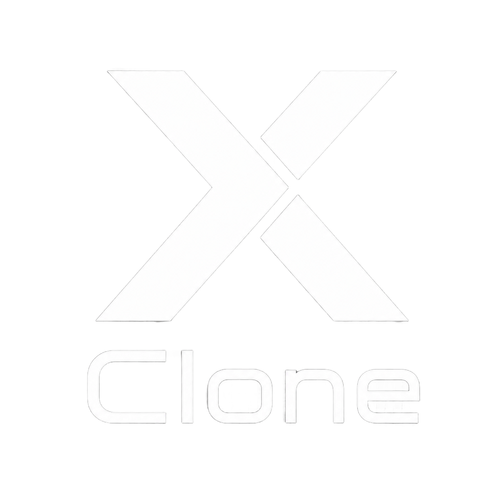
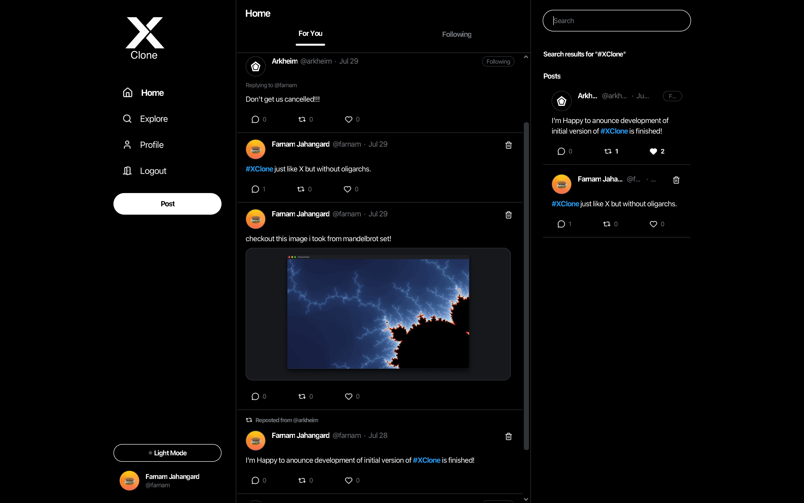
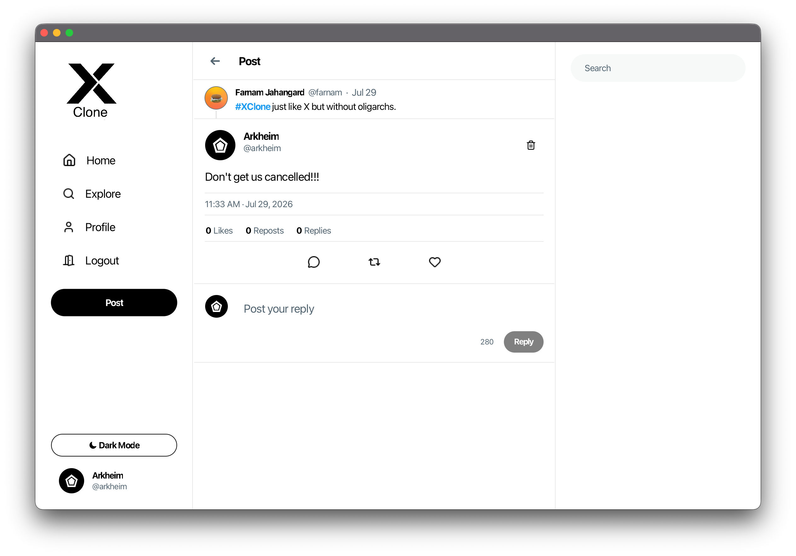
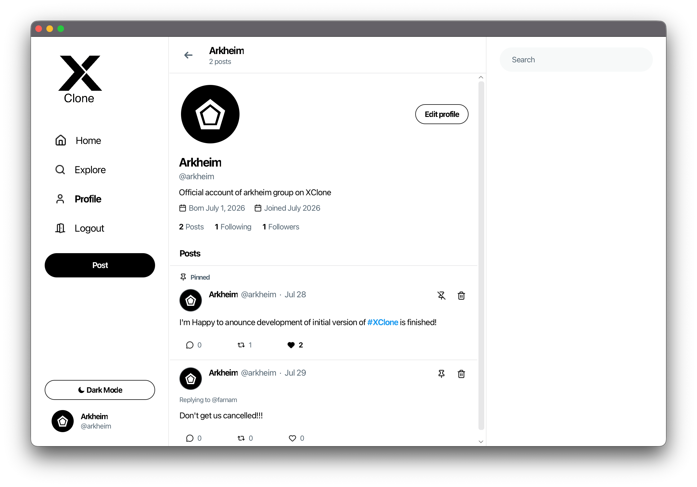
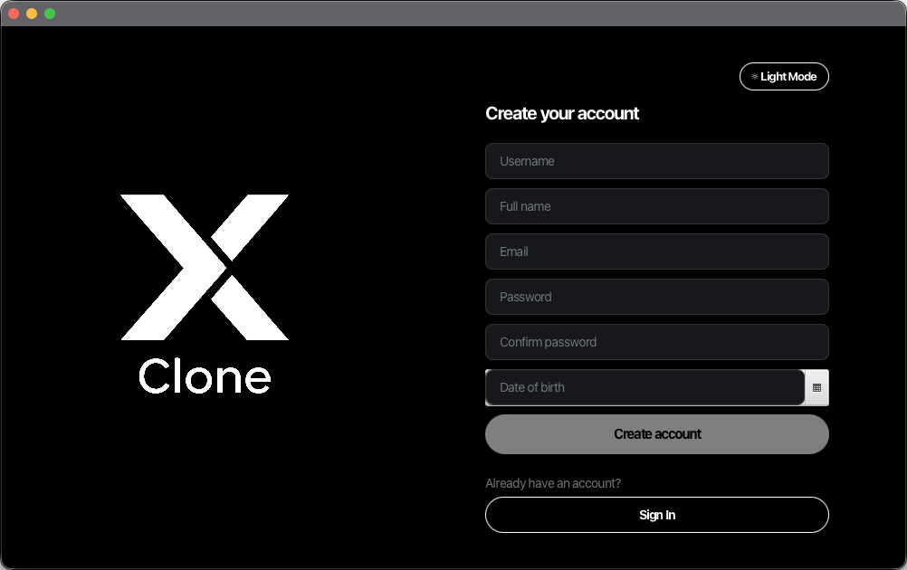

# XClone
<p align="center">

</p>

A full-stack clone of [X](https://x.com) (formerly known as Twitter) written in java.  
[](https://conventionalbranch.org) [](https://www.conventionalcommits.org/en/v1.0.0/)

---
## Table of contents
  - [Screenshots](#screenshots)
  - [Tech Stack](#tech-stack)
    - [Server](#server)
    - [Client](#client)
  - [Architecture 📐](#architecture-)
  - [Prerequirements ‼️](#prerequirements-️)
  - [How to build 🧱](#how-to-build-)
    - [Server](#server-1)
    - [Client](#client-1)
  - [Credits](#credits)

## Other Documentations
- [Technical Documentations Index](./docs/technical_index.md)
- AI Report
  - [Farnam's AI Report](./docs/ai_report/farnam_ai_report.md) 
  - [Matin's AI Report](docs/ai_report/matin_ai_report.md)
  - [Ramtin's AI Report](docs/ai_report/ramtin_ai_report.md)
- Resources
  - [Farnam's Resources](./docs/resources_report/farnam_resources.md)
---
## Screenshots
<p align="center">
 
 
</p>

---
## Tech Stack
###  Server
| Field                      | Tehnology                                                                                                                                                   |
|----------------------------|-------------------------------------------------------------------------------------------------------------------------------------------------------------| 
| **Main language**          |                                                            |     
| **Framework**              |                                           |     
| **Continuous integration** |                                                          |     
| **Database**               |                                                            |     
| **Networking**             |   |  
| **Scripting Language**     |                                           |

### Client
| Field             | Tehnology                                                                                         |     
| ----------------- | ------------------------------------------------------------------------------------------------- | 
| **Main language** |  |          
| **Framework**     |                           |          
| **Styling**       |                        |
| **Networking**    |   |

---
## Architecture 📐
The project in whole uses a simple client-server architecture, however each of those modules leverages **Clean architecture** for independent development, decoupled structure, code adaptability and scalability.  
for more technical detail checkout [Technical information about architecture](docs/technical_docs/architecture_report.md)

---
## Prerequirements ‼️
- Java 25 (required)
- Maven (optional)
- Kotlin compiler / IntelliJ Idea (optional)
- MySQL (optional*)
- Docker desktop / Docker engine + Docker composer (optional*)
> \*: You can run the server module either by building the docker image or running a MySQL Server and configuring a file and running server manually.

## How to build 🧱
### Server
For the server module you can do two things:
1. Build and run server manually
2. Run server with docker
To run the server using docker you can read the [docker readme](server/README.Docker.md). 

but to run the server without the docker:
1. Clone the repo:
```bash
git clone https://github.com/ArkheimGroup/XClone.git
cd XClone
```
2. Run a MySQL Server
3. Configure `application.properties` inside resources folder: `XClone/server/src/main/resources/application.properties` (edit any variable shown with a `${}` to their actual value, e.g. `${DB_HOST}` -> `127.0.0.1`)  
> IMPORTANT: You can do the configuration using a kotlin script inside root of the project called `configure-db.kts`
> to do this you can right click on `configure-db.kts` and `Run configure-db.kts` inside IntelliJ or you can run it in terminal using kotlin compiler:
> ```bash 
> kotlinc -script configure-db.kts
> ```

> Note: You either need to change this file or declare environment variables, to declare environment variables enter every field inside the `application.properties` that is Shown like this: `${}` followed by a `=` and their value **inside your terminal**. e.g. `${DB_HOST}` -> `DB_HOST=127.0.0.1`
4. Compile the application: (run inside `XClone/server`) [On the same shell session as you declared your enviornment variables if you gone that way]
```bash
mvn clean package
```
> Note: if you don't have maven installed on your machine run: `./mvnw clean package` (for UNIX-Like/UNIX-Based operating systems like macOS or Linux) or `.\mvnw.cmd clean package` (for windows).

5. Finally to run the server module:
```bash
java -jar target/*.jar
```

if you use Intellij Idea you can skip `4` and `5` and run `ServerApplication.java`

### Client
Building client is much more straight forward:
1. Clone the repo:
```bash
git clone https://github.com/ArkheimGroup/XClone.git
cd XClone
```
2. build the project: (run inside XClone/client)
```
mvn clean package
```
3. run the app:
```bash
java -jar target/*.jar
```
---
## Credits
This project wouldn't be possible without help of:  
[Matin Ardestani](https://github.com/Matin-Ardestani)   
[Ramtin Jafari](https://github.com/RamtinJafari)  
[Farnam Jahangard](https://github.com/farnam-jhn)  

For the icons: [Lucide icons](https://lucide.dev)  
repo badges: [Shields.io](https://shields.io)  

## License
This project is licensed under GNU GPL v3, see [LICENSE](LICENSE) for more info.