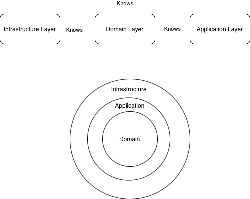
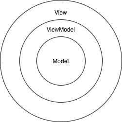
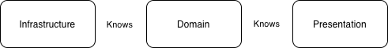

# Architecture
This document examines the architecture of XClone.  
- [Server](#server)
- [Client](#client)
---
# Server

## Layers
Server modules consists of three layers:
#### 1. Domain Layer
Domain Layer is the core layer of application. any other layer would know about this layer since this is where project is rooted.
Domain layer has two important class types:
1. **Entities**: They represent a row of database tables (e.g. User, Post...)
2. **Repository**: Repositories are a blue print of what should be done with the database, this means that they should be interface. later on they would be used inside application layer services (application layer should use the raw interface inside the code), and they are implemented inside infrastructure layer. Later on the implementations inside infrastructure layer should be injected to the application layer. This is useful because it decouples application layer and infrastructure layer.
#### 2. Application Layer
Application layer should implement any business logic inside it. things like authentication, registration and...
Application layer consists of few class types:
1. **DTOs**: Data Transfer Objects or DTOs wrap the entities inside domain layer for transformation.
2. **Services**: As i said before, services should implement any business logic for the project.
#### 3. Infrastructure Layer
Infrastructure layer does all the dirty work for IO and Database operations.
Infrastructure layer consists of few folders:
1. **API**: RESTful API Controllers live inside this folder, they map different endpoint to a block of code which calls a service from the application layer to do the job
2. **Repository**: This folder contains implementations of domain layer repositories, these are the one to later on inject to the application layer.
## Diagram



## Tree 

```Tree
server
├── application
│   ├── dtos
│   │   ├── CreatePostRequest.java
│   │   ├── RegisterMediaRequest.java
│   │   ├── responses
│   │   │   ├── PostResponse.java
│   │   │   ├── UserProfileResponse.java
│   │   │   └── UserResponse.java
│   │   ├── UpdateProfileRequest.java
│   │   ├── UserLoginRequest.java
│   │   └── UserRegisterRequest.java
│   ├── ports
│   │   └── PasswordEncoderPort.java
│   └── services
│       ├── HashtagService.java
│       └── *Service.java
├── domain
│   ├── entities
│   │   ├── Hashtag.java
│   │   ├── Like.java
│   │   ├── Media.java
│   │   ├── Post.java
│   │   └── User.java
│   └── repository
│       ├── FollowRepository.java
│       └── *Repository.java
├── infrastructure
│   ├── api
│   │   ├── controllers
│   │   │   ├── AuthController.java
│   │   │   └── *Controller.java
│   │   └── GlobalExceptionHandler.java
│   ├── config
│   │   └── AppConfig.java
│   ├── repository
│   │   ├── JdbcHashtagRepository.java
│   │   └── Jdbc*Repository.java
│   ├── socket
│   │   └── SocketFeedServer.java
│   └── utils
│       ├── BCryptPasswordEncoderPort.java
│       └── UuidBinaryConvertor.java
└── ServerApplication.java
```

To replicate the actual tree, run inside root of XClone:

```bash
tree server/src/main/java/arkheim/server
```

---
# Client
## Layers
Client module also consists of three layers:
#### 1. Domain Layer
like server this layer has two folders:
1. **Entities**: these are the core models of what is present on each row of the database, however they are different in few ways (e.g. they don't have a password field).
2. **Ports**: Ports are the same thing as server's domain layer repositories, however due to naming convention they are not repositories as they don't access a database or a storage directly.
#### 2. Presentation Layer
This layer alone leverages another architecture itself: Model View ViewModel or MVVM.



In this architecture, Views handles user interactions and sends the events to ViewModels where they perform the required task and manipulate the model which is present inside server's database.
#### 3. Infrastructure Layer
Inside this layer there are **Adapters** which adapts (implements) Ports inside domain layer to DI into ViewModels.
## Diagram



## Tree 

```Tree
# TO BE ADDED
```

To replicate the actual tree, run inside root of XClone:

```bash
tree client/src/main/java/arkheim/client
```
