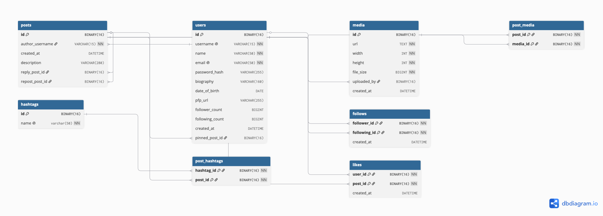

# Database
this document examines database tables.  

The ERM is pretty much self-explanatory but there are things that i wan't to discuss about
## 1. Id's data type
We used `BINARY(16)` as Id's data type, this is because databases don't have built in support for `UUID`.   
therefore Id's would get converted into raw bytes using the convertors inside infrastructure layer (`UuidBinaryConvertor` inside `utils` folder)  
and then get's stored in the database and whenever a read operation is done on the database it would get converted back to `UUID`.
## 2. Junction tables
there are tables present in the database consisting only foreign keys.  
thees are called **Junction table** that would get joint when queries run.
tables like `post_hashtags` and `post_media` are junction tables and they would join `posts` with `hashtags` and `media`
there are other tables like this with a slight difference: unlike pure junction tables they have additional contextual data. 